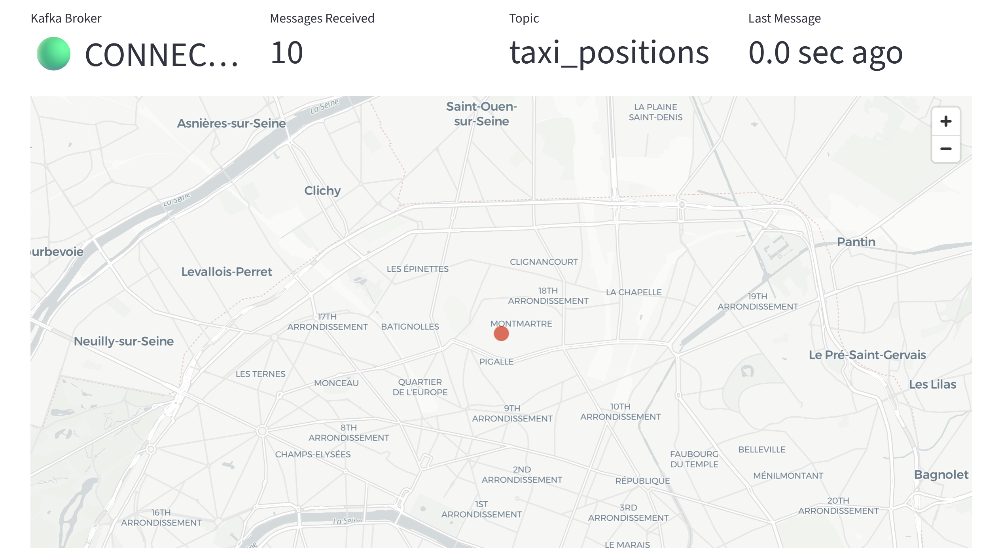
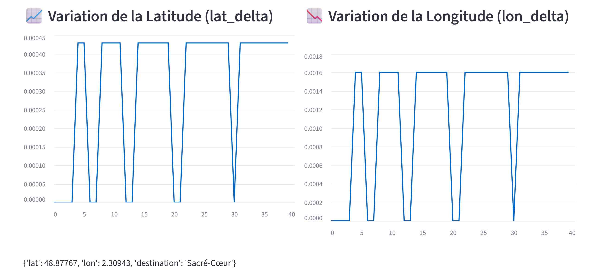
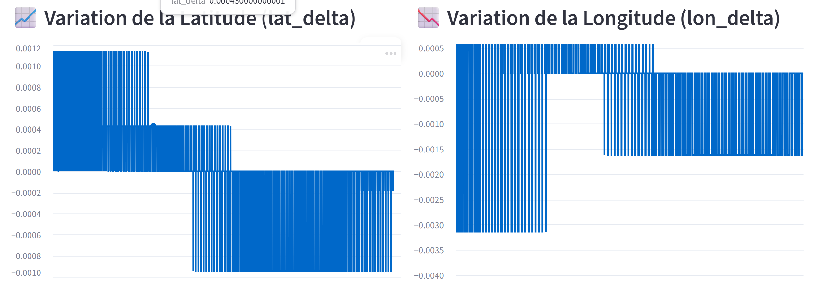
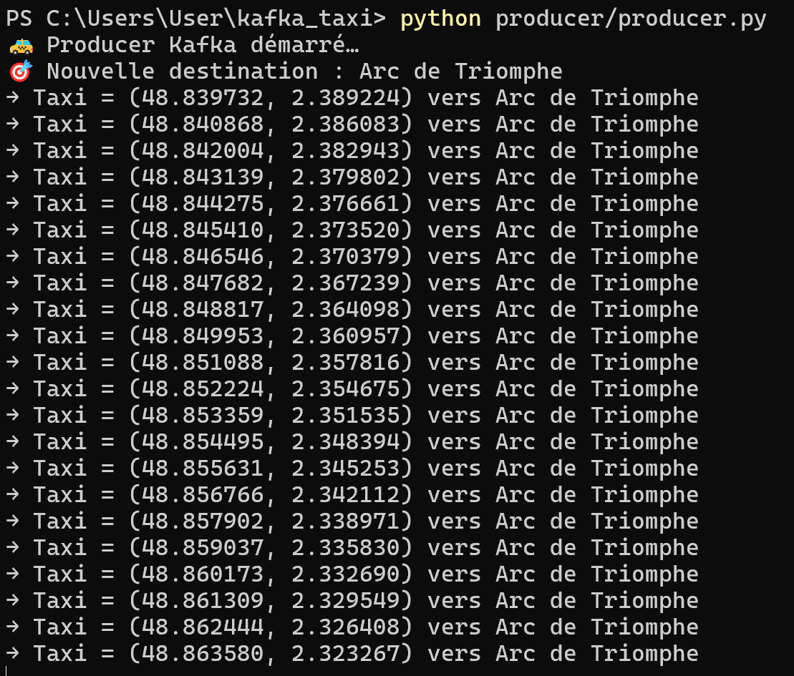
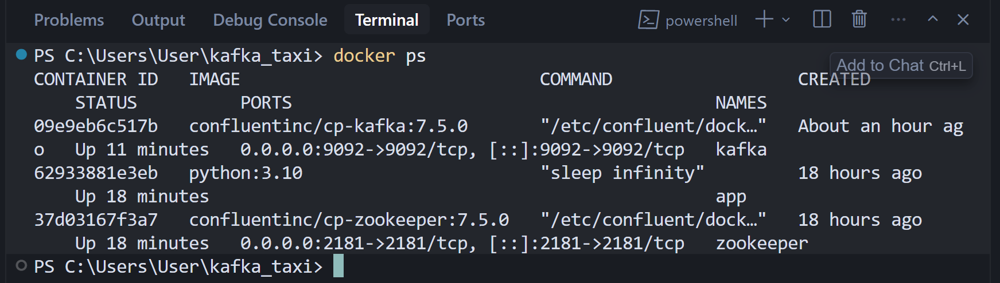
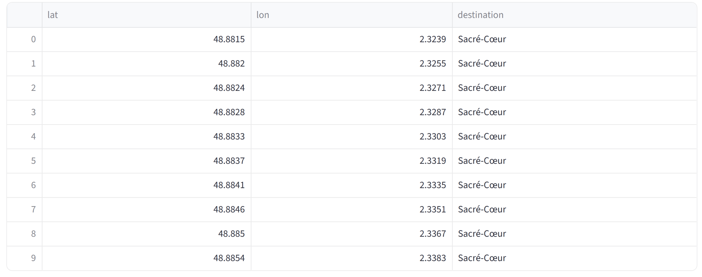
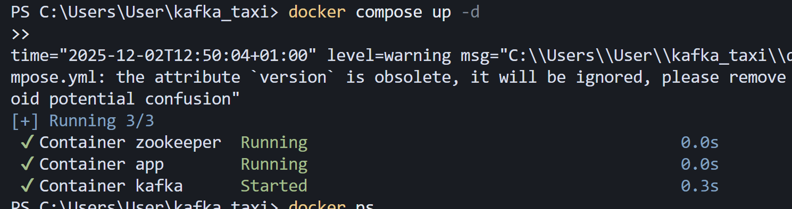

# 🚕 Kafka Taxi Tracker — Real-Time Big Data Project

Projet réalisé dans le cadre du cours **Big Data & Distributed Systems**.  
Ce projet met en œuvre un pipeline **temps réel** basé sur **Apache Kafka** et visualisé via **Streamlit**.

---

# 🎯 Objectif du projet

Mettre en place un cas d’usage simple mais complet d’un pipeline Big Data :

- Un **producer Kafka** génère en continu la position GPS d’un taxi à Paris  
- Les données sont envoyées dans un **topic Kafka**  
- Un **consumer Streamlit** lit les messages en temps réel  
- Un **dashboard interactif** affiche :  
  - la carte  
  - les indicateurs Kafka  
  - l’historique des positions  
  - deux graphiques en temps réel  
  - les logs JSON  

L’objectif : démontrer ma compréhension d’un **système de streaming**.

---

# 🛠️ Technologies utilisées

- **Apache Kafka** (streaming distribué)
- **Docker Compose** (déploiement local)
- **Python** (producer & consumer)
- **Kafka-Python**
- **Streamlit** (dashboard)
- **Pandas / JSON**

---

# 🚀 Installation & Exécution

## 1. Installer les dépendances Python

```bash
pip install kafka-python streamlit pandas
2. Lancer Kafka via Docker
docker compose up -d

3. Lancer le Producer (envoi GPS)
python producer/producer.py

4. Lancer le Dashboard Streamlit
streamlit run streamlit_app.py --server.headless true


Puis ouvrir :
👉 http://localhost:8501

🧱 Architecture Big Data (schéma)
flowchart LR
    A[🚕 Producer Python<br/>GPS Generator] -->|JSON messages| B((🟣 Kafka Topic<br/>taxi_positions))
    B --> C[🟦 Consumer Streamlit]
    C --> D[🟩 Dashboard Temps Réel<br/>Map + Charts + Logs]

Explications :

Kafka sert de système de messaging tolérant aux pannes

Le producer génère un flux unbounded data

Le consumer lit uniquement les messages récents (latest)

Streamlit sert d’interface pour visualiser un cas Big Data en temps réel

📸 Screenshots (à ajouter)

Dashboard Streamlit



Terminal producer

docker ps

Topic listing

Logs Kafka



🐞 My Setup Notes
❌ Problème rencontré : NoBrokersAvailable

Lors des premiers tests, le producer Python n’arrivait pas à se connecter à Kafka.

🔍 Diagnostic

Kafka n’était pas lancé

Le port 9092 n’était pas exposé

Le consumer Streamlit utilisait un ancien offset

✅ Solution

Redémarrer Docker :

docker compose down
docker compose up -d


Vérifier Kafka :

docker logs kafka
docker ps


Utiliser :

auto_offset_reset="latest"
group_id="streamlit-<timestamp>"
enable_auto_commit=False

🎉 Résultat

Connexion stable + dashboard en temps réel fonctionnel.

📂 Structure du projet
/kafka-taxi-project
│
├── producer/
│   └── producer.py
│
├── consumer/
│   └── streamlit_consumer.py
│
├── docker-compose.yml
├── Images/          # Screenshots
└── README.md